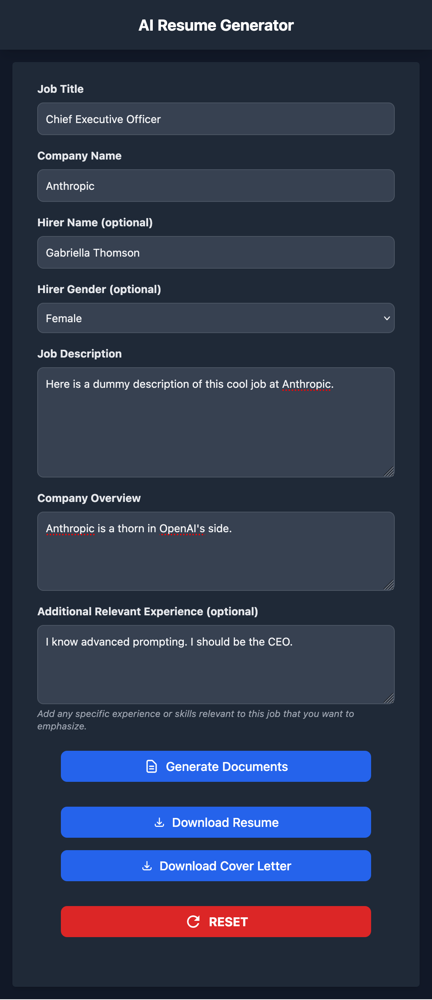

# AIRG

**AI Resume Generator** (v1.2)

Say "AIR-G" or "A.I.R.G" as you see fit.

AI Resume Generator. AIRG is a web app that crafts personalized resumes and cover letters using Google's Gemini AI. Input your resume, job details, and company info to generate tailored documents. Features real-time updates, dark mode, and PDF/HTML outputs. Ideal for job seekers aiming to match specific job requirements.

The application currently uses Gemini 2.0 Flash Thinking model, which is free to use while in its Experimental phase.



## Features

- Customizes your resume and cover letter based on job description and company details
- Optimize keywords, skills etc. for maximum scoring in ATS (Applicant Tracking Systems)
- Tested with [Jobscan](https://www.jobscan.co)
- Uses Gemini 2.0 Flash Thinking for enhanced reasoning and customization
- Optional fields for hirer name and gender to personalize cover letters
- Additional field for relevant experience to emphasize specific skills
- Generates professional PDF documents with consistent styling
- Generates both HTML and PDF versions of documents
- Real-time progress updates during document generation
- Dark mode support (follows system preferences)
- Maintains a comprehensive XLSX log of all job applications

## Architecture

- Built with Flask for simplicity and reliability
- Server-Sent Events (SSE) for real-time progress updates
- Synchronous document generation using Google's Gemini API
- PDF generation using Playwright
- Thread-safe message queue for progress updates

## Prerequisites

- Python 3.8+
- Gemini API key (obtain from [Google AI Studio](https://aistudio.google.com/app/apikey))
- A modern web browser (works well on mobile screen)

## Installation

1. Clone the repository:
```bash
git clone https://github.com/yourusername/airg.git
cd airg
```

2. Install Python dependencies:
```bash
pip install -r requirements.txt
```

3. Install Chromium for PDF generation:
```bash
playwright install chromium
```

4. Copy the example environment file:
```bash
cp .env.example .env
```

5. Update the `.env` file with your settings:
   - Set `GEMINI_API_KEY` with your API key from Google AI Studio
   - Generate a secure random string for `SECRET_KEY` (you can use `python -c "import secrets; print(secrets.token_hex())"`)
   - Optionally enable XLSX logging by uncommenting and setting `PATH_TO_XLSX_LOG`:
     ```bash
     # Example for macOS with Google Drive sync:
     PATH_TO_XLSX_LOG=/Users/username/Library/CloudStorage/GoogleDrive-email@gmail.com/My Drive/Job Search/applications.xlsx
     ```
     The application will create the file and parent directories if they don't exist.
     The XLSX file will be created with a sheet named "AIRG log" containing:
     - Date and time of application
     - Company/Recruiter name
     - Job title
     - Job posting URL
     - Hirer name
     
     This feature is particularly useful for:
     - Maintaining a centralized record of all job applications
     - Documenting job search efforts for unemployment benefits/allowance claims
     - Accessing application history from any device through cloud storage (Google Drive, OneDrive, iCloud)
     - Safely deleting generated documents while keeping the application log

6. Copy the example HTML files:
```bash
cp resume/resume.example.html resume/resume.html
cp resume/letter.example.html resume/letter.html
```

And edit your resume and letter HTML files to your liking.

## Usage

1. Run the application:
```bash
python app.py
```

2. Open your browser and navigate to `http://localhost:5000`

3. Fill in the job details form:
   - Job Title
   - Company Name
   - Hirer Name (optional)
   - Hirer Gender (optional)
   - Job Description
   - Company Overview
   - Additional Relevant Experience (optional)

4. Click "Generate Documents" and wait for the process to complete

5. Download the generated resume and cover letter in PDF format

## Document History

All generated documents are archived in the `resume_gen` directory, organized by timestamp and job details, in both PDF and HTML formats. This allows you to keep track of your application history and reuse documents if needed.

## Development Status

This project has been tested only locally, on macOS 15.2 (Sonoma). While it should work on other platforms, and maybe on the web, additional testing may be required.

## Contributing

Contributions are welcome! Please feel free to submit a Pull Request.

## License

This project is licensed under the Apache License 2.0 - see the LICENSE file for details.

## Attribution

Attribution to Livingston Larus is appreciated. Please include the following notice in any distributions:

"Copyright 2024 Livingston Larus"

For more information, visit [Livingston Larus](https://livingstonlarus.com).